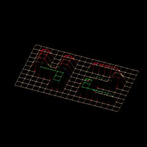
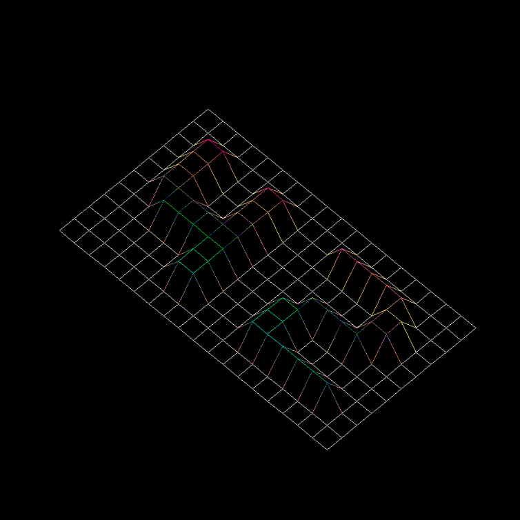
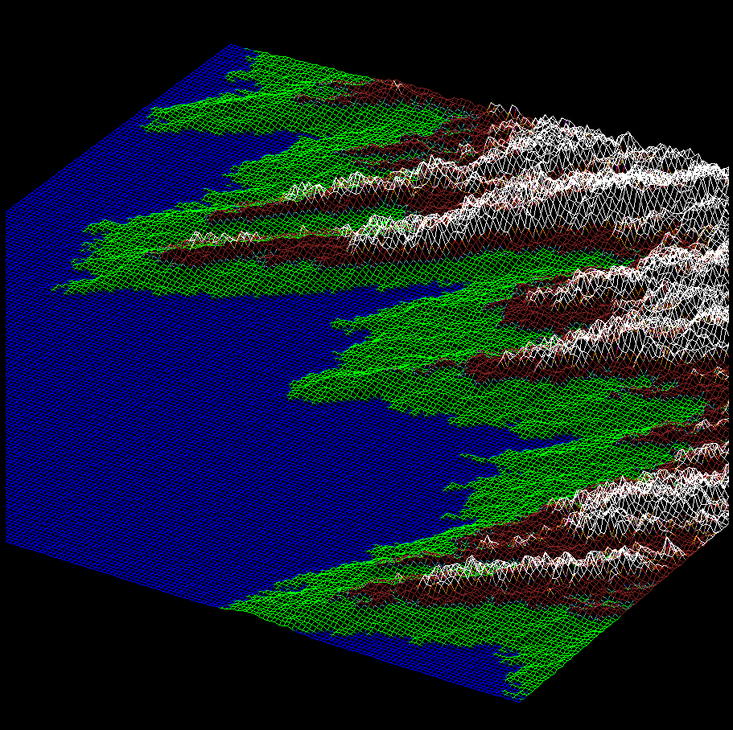
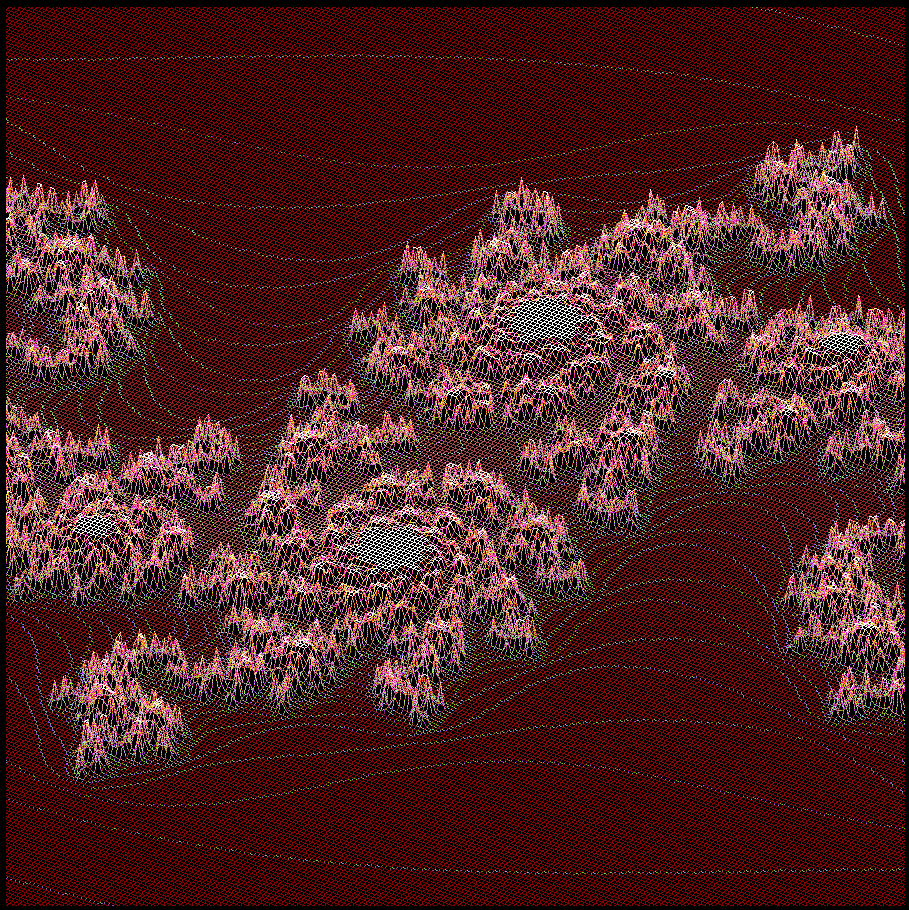

# 🌐 FdF - 3D Wireframe Renderer


<div align="center">

**Real-time 3D wireframe visualization of heightmap data with interactive rotation and scaling.**



</div>
## 🎯 Overview

**FdF** (Fil de Fer - "Wire Frame" in French) transforms 2D heightmap files into stunning 3D wireframe visualizations. The project demonstrates advanced graphics programming concepts including 3D transformations, projection mathematics, and real-time rendering using the MiniLibX graphics library.

## 🚀 Key Features

### 🎮 Interactive Controls
- **Mouse Rotation**: Click and drag to rotate the wireframe in real-time
- **Mouse Wheel**: Zoom in and out in the 3D projection
- **Keyboard Input**: Arrow keys for precise control of rotation and tilt, plus H/L keys to change the scale of the heigth
- **Dynamic Scaling**: Automatic screen and height scaling for optimal viewing

### 🎨 Visual Elements
- **Color Support**: Custom colors defined in `.fdf` files (hexadecimal format)
- **Gradient Rendering**: Smooth color transitions between height levels
- **Real-time Display**: Smooth 60fps rendering with immediate visual feedback

### 📐 Mathematical Precision
- **Polar Coordinate System**: Efficient r_p and theta_p transformations for more efficient rotations
- **Isometric Projection**: Default 45° viewing angle with configurable perspective

## 🏗️ Technical Architecture

```
FdF/
├── wireframe.h          # Core structures and function declarations
├── wireframe.c          # Main program and MLX initialization
├── print_wireframe.c    # Point and line rendering engine
├── rotate.c             # 3D transformation mathematics
├── set_map.c           # Heightmap parsing and matrix construction
├── utils.c             # Input handling and memory management
└── test_maps/          # Sample heightmap files (.fdf format)
```

## 🎤 **Featured at 42 Berlin Tech Talk**

<div align="center">


</div>

This project was **presented live** at a 42 Berlin community tech event, showcasing advanced 3D graphics programming and mathematical concepts to an audience of fellow students, alumni, and industry professionals.

### 📽️ **Embedded Presentation**

<div align="center">

<iframe src="https://docs.google.com/presentation/d/e/2PACX-1vSd-gHJWzDRxyDvsyjszxDbkiWy5boAiz-ZUhRsGa-EdbIhQ0b_VNF3vEQxPE9SVrhxOO6WV3GQGOVZ/pubembed?start=true&loop=true&delayms=5000"
        frameborder="0"
        width="100%"
        height="480"
        style="max-width: 800px; border-radius: 8px;"
        allowfullscreen="true"
        mozallowfullscreen="true"
        webkitallowfullscreen="true">
</iframe>

<br>

<a href="https://docs.google.com/presentation/d/1Mg6n0uu_KGf5YLiEP_f0mZA0KRvy47b29JZl51ENG2w/edit?usp=sharing">

</a>

<br>

*Complete slide deck covering 3D mathematics, implementation details, and technical challenges*

</div>

### 🎯 **Event Success Metrics**

<div align="center">

| **📊 Presentation Highlights** | **👥 Audience Engagement** |
|:------------------------------:|:--------------------------:|
| 🔴 **Live Coding Demonstration** | 🎓 **42 Students & Alumni** |
| 🧮 **3D Math Deep-dive** | 💼 **Industry Professionals** |
| 🎮 **Real-time Interaction** | ❓ **Interactive Q&A Session** |
| 📐 **Technical Architecture** | 🔄 **Peer Code Review** |

</div>

### 💻 **Live Demo Video**

<div align="center">

https://github.com/user-attachments/assets/fdf-demo.mp4

*Interactive 3D visualization showing rotation, scaling, and different heightmap examples including the iconic "42" logo wireframe.*

**📺 Note**: Click the link above to view the video directly in your browser. GitHub will stream the video with built-in player controls.

</div>

### 🖼️ **Visual Gallery**

<div align="center">

| 42 Logo Wireframe | Coastline Topography | Julia Fractal |
|:-----------------:|:-------------------:|:-------------:|
|  |  |  |
| *Iconic 42 logo in 3D* | *Coastline surface data* | *Mathematical visualization* |

</div>

> **💡 Event Impact**: Successfully demonstrated real-time 3D transformations, mathematical precision of polar coordinate systems, and advanced graphics programming concepts to an engaged audience of 42 students and tech professionals.

## 🔧 Usage

```bash
# Compile the project
make

# Run with a heightmap file
./fdf test_maps/42.fdf
./fdf test_maps/elem.fdf
./fdf test_maps/mars.fdf
```

### 🎮 Controls
- **Mouse**: Click and drag to rotate the wireframe
- **ESC**: Exit the program
- **Arrow Keys**: Fine rotation control
- **H/L Keys**: Height scale control
- **Mouse Wheel**: Zoom in/out

## 📊 Heightmap Format

FdF reads `.fdf` files containing space-separated height values:

```
# Basic heightmap (elem.fdf)
0  0  0  0  0  0  0  0  0  0
0 10 10 10 10 10 10 10 10  0
0 10 20 15 12 15 17 20 10  0
0 10 15 10 12 15 15 15 10  0
0  0  0  0  0  0  0  0  0  0

# With custom colors (42.fdf)
0,0xff0000 10,0x00ff00 0,0x0000ff
```

**Format Support:**
- **Heights**: Integer values representing elevation
- **Colors**: Optional hexadecimal colors (`0xRRGGBB`)
- **Large Maps**: Handles complex terrains like Mars topography

## 🧮 3D Mathematics Implementation

### Coordinate System Transformation
```c
// Convert 2D grid to polar coordinates
r_p = sqrt(pow((j - cols/2), 2) + pow((i - rows/2), 2));
theta_p = atan2((rows/2 - i), (j - cols/2));
```

### 3D Rotation based on Polar Coordinates
```c
// Z-axis rotation (theta)
void rotate_z(t_vars *data) {
    data->matrix[i][j].theta_p += data->theta * PI / 180;
}

// 3D spin with height integration (phi)
void spin(t_vars *m) {
    x = r_p * cos(theta_p);
    y = r_p * sin(theta_p);
    y = y * cos(phi) + height * height_scale * sin(phi);
    // Update polar coordinates with new position
}
```

### Projection to Screen
```c
// Convert 3D coordinates to 2D screen pixels
x = r_p * cos(theta_p) * screen_scale + SCREEN_CENTER_X;
y = r_p * sin(theta_p) * screen_scale + SCREEN_CENTER_Y;
```

## 🎨 Advanced Features

### **Adaptive Scaling System**
- **Screen Scale**: Automatically fits wireframe to window size
- **Height Scale**: Proportional Z-axis scaling for optimal depth perception
- **Dynamic Adjustment**: Real-time recalculation based on map dimensions

### **Efficient Line Drawing**
- **Bresenham's Algorithm**: Optimized line rendering between connected points
- **Color Interpolation**: Smooth gradients along wireframe edges
- **Pixel-Perfect Rendering**: Sharp, anti-aliased wireframe visualization

### **Memory Management**
- **Dynamic Allocation**: Efficient matrix storage for variable map sizes
- **Proper Cleanup**: Zero memory leaks with comprehensive free functions
- **Error Handling**: Robust file parsing with validation

## 📈 Sample Visualizations

| Map | Description | Complexity |
|-----|-------------|------------|
| **42.fdf** | 42 School logo wireframe | Simple geometric shapes |
| **elem.fdf** | Basic pyramid structure | Educational example |
| **mars.fdf** | Mars surface topography | High-resolution terrain |
| **julia.fdf** | Julia set fractal | Mathematical visualization |
| **pyramide.fdf** | 3D pyramid structure | Geometric solid |

## 🛠️ Technical Specifications

| Feature | Implementation | Details |
|---------|----------------|---------|
| **Graphics Library** | MiniLibX | Low-level pixel manipulation |
| **Coordinate System** | Polar (r, θ) | Efficient rotation calculations |
| **Projection** | Isometric | 3D to 2D transformation |
| **Color Depth** | 24-bit RGB | Full color spectrum support |
| **Window Size** | 920x920 pixels | Optimized viewing area |
| **Frame Rate** | Real-time | Smooth interactive experience |

## 🏆 Skills Demonstrated

### **3D Graphics Programming**
- **Coordinate Transformations**: 2D to 3D mapping with polar coordinates
- **Rotation Mathematics**: Matrix transformations and trigonometric calculations
- **Projection Systems**: Converting 3D space to 2D screen coordinates

### **Mathematical Concepts**
- **Linear Algebra**: Vector operations and coordinate system conversions
- **Trigonometry**: Sin, cos, atan2 for rotation and positioning
- **Geometry**: Spatial relationships and perspective calculations

### **Systems Programming**
- **File I/O**: Efficient parsing of large heightmap files
- **Memory Management**: Dynamic allocation for variable-sized datasets
- **Graphics Pipeline**: Low-level pixel manipulation and rendering

### **User Interface Design**
- **Interactive Controls**: Mouse and keyboard input handling
- **Real-time Feedback**: Immediate visual response to user actions
- **Intuitive Navigation**: Natural rotation and scaling controls

## 🔬 Project Challenges Solved

### **1. 3D Rotation Mathematics**
- **Challenge**: Implementing proper 3D rotations without matrix libraries
- **Solution**: Custom polar coordinate system with trigonometric transformations
- **Result**: Smooth, mathematically accurate rotations in all axes

### **2. Dynamic Scaling**
- **Challenge**: Automatically fitting wireframes of varying sizes to screen
- **Solution**: Adaptive scaling algorithms based on map dimensions and screen size
- **Result**: Optimal visualization regardless of input data complexity

### **3. Real-time Rendering**
- **Challenge**: Maintaining smooth performance with complex wireframes
- **Solution**: Efficient coordinate caching and optimized drawing algorithms
- **Result**: Interactive experience with immediate visual feedback

### **4. Color Integration**
- **Challenge**: Supporting both height-based and custom color rendering
- **Solution**: Flexible parsing system handling optional color specifications
- **Result**: Rich visual representations with customizable aesthetics

## 🎯 Real-World Applications

This project demonstrates skills directly applicable to:

- **Game Development**: 3D rendering pipelines and coordinate transformations
- **CAD Software**: Technical drawing and wireframe visualization
- **Data Visualization**: Converting numerical data into visual representations
- **Scientific Computing**: Terrain modeling and topographic visualization
- **Computer Graphics**: Fundamental 3D programming concepts

---

<div align="center">

**Built with precision mathematics and creative vision**

*A comprehensive 3D graphics project showcasing advanced programming concepts in C.*

</div>
