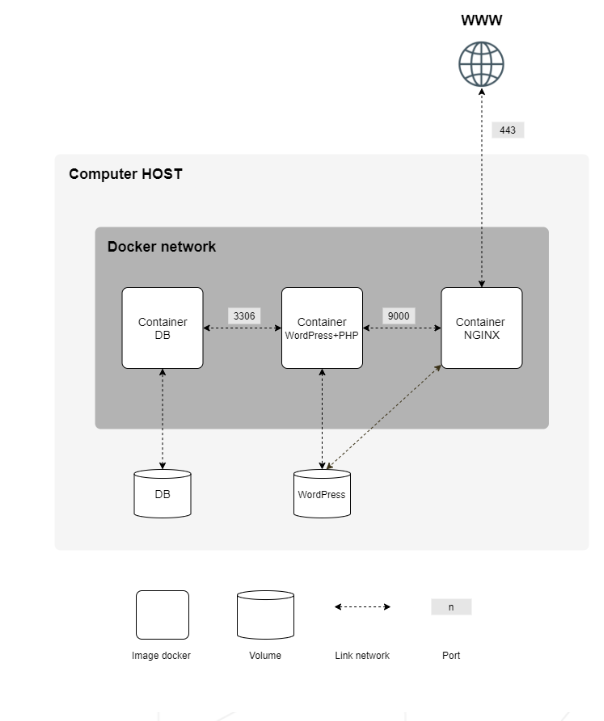

# Inception – How to Think About It

I wanted to write this text to first help me understand this project better. For those who don't know me, I'm a former 42 student and this text is an explanation, in general terms, of one of the projects we do in the curriculum: **Inception**.

The idea of the project is to implement a WordPress service with MariaDB for data persistence and an NGINX server to forward requests. That is the goal we are pursuing:

**Before you continue reading I want to warn you:** If you like me don't like to simply copy paste code you find in the internet and want to write your own, first of all Kudos =), second, I recommend you read this article with your code editor closed. The code and the solutions are also given in this article but my main point here is to show the mental model I used to structure the solution. Of course, the result I'm showing is the answer to solve the problem, but if you just read and understand the logic you won't be copying; you will know what needs to be put where and more importantly, you will know what to search for when you find an error in your code.

With that said, let's start by reading the subject

---

## Where do we start?

The subject gives us the general structure we have to implement:



It also gives us the suggested folder tree to start our development:

```
.
├── Makefile
├── secrets
│   ├── credentials.txt
│   ├── db_password.txt
│   └── db_root_password.txt
└── srcs
    ├── docker-compose.yml
    ├── .env
    └── requirements
        ├── bonus
        ├── mariadb
        │   ├── conf
        │   ├── Dockerfile
        │   ├── .dockerignore
        │   └── tools
        ├── nginx
        │   ├── conf
        │   ├── Dockerfile
        │   ├── .dockerignore
        │   └── tools
        ├── tools
        └── wordpress
            ├── conf
            ├── Dockerfile
            ├── .dockerignore
            └── tools
```

And that's it. Apart from that, we have to figure things out for ourselves.

So the first thing — if you have no idea what Docker and Dockerfiles are, I recommend you pause for a moment and look at a few details about those concepts. I have a link to another post where Claude explained to me the basics I used to make this project — it might be useful for you too.

Assuming you have already created the suggested tree and have a general understanding of Docker, you might, like me, get stuck on *exactly what to do first*. So here is what I recommend:

---

## The Makefile – giving yourself a trigger

Let's start from the beginning of your code so you can already see some things moving.

```makefile
NAME = Inception
DOCKER_COMPOSE_FILE = srcs/docker-compose.yml

all: run_docker

run_docker:
	@echo "\033[33m \n-- RUNNING DOCKER --\033[0m"
	@docker compose -f $(DOCKER_COMPOSE_FILE) up --build

clean:
	@echo " \n\033[43m- PRINTING ALL RUNNING CONTAINERS -\033[0m"
	@docker ps
	@echo " \n\033[43m- STOPPING CONTAINERS -\033[0m"
	@docker compose -f srcs/docker-compose.yml down
	@echo "\n\033[32m ----- All containers stopped! ----- \033[0m"

fclean:
	@docker system prune -af
	@$(MAKE) --no-print-directory clean

re_f: fclean all
re:   clean all

.PHONY: all clean fclean re re_f run_docker
```

When run, this will simply execute:

```sh
docker compose -f srcs/docker-compose.yml up --build
```

As of now, nothing should happen — we have nothing in our `docker-compose.yml`. So let's fix that.

---

## The docker-compose.yml – the blueprint of your system

This file needs to answer a few questions:

- What services will be running?
- What network will the containers share?
- What secrets are we injecting?
- What volumes exist and where?

A skeleton with those four concerns looks like this:

```yaml
services:
  mariadb:
    # (we'll fill this in below)

networks:
  inception:
    driver: bridge

secrets:
  db_password:
    file: ../secrets/db_password.txt
  db_root_password:
    file: ../secrets/db_root_password.txt
  db_admin_password:
    file: ../secrets/db_admin_password.txt

volumes:
  vol-mariadb:
    driver: local
    driver_opts:
      type: none
      o: bind
      device: /home/${USER}/mariadb
```

> **Note on `${USER}`:** Docker Compose reads variable substitutions from your `.env` file. Make sure `USER` is declared there (or exported in your shell environment) — otherwise the volume bind will fail silently. We'll cover the `.env` file shortly.

I won't go into much detail about networks, secrets, and volumes because for this project the implementation is fairly standard. What matters is the service definition itself. Each service needs:

- A name for the image
- Build details (where is the context and Dockerfile)
- Which secrets it will consume
- What environment variables it needs
- A restart policy
- Which volumes and networks it attaches to


For MariaDB, that looks like this:

```yaml
  mariadb:
    build:
      context: ./requirements/mariadb
      dockerfile: Dockerfile
    secrets:
      - db_password
      - db_admin_password
      - db_root_password
    environment:
      DB_NAME: "${DB_NAME:-mariadb}"
      DB_USER: "${DB_USER:-user1}"
      DB_ADMIN: "${DB_ADMIN:-adm}"
      DB_PORT: "${DB_PORT:-3306}"
    restart: unless-stopped
    volumes:
      - vol-mariadb:/var/lib/mysql
    networks:
      - inception
```

---

## A quick word on the `.env` file

You might have noticed variables like `${DB_NAME}` and `${DB_PORT}` appearing above without being defined anywhere yet. They come from your `.env` file, which Docker Compose automatically reads when it starts. It sits at `srcs/.env` and should declare all the variables your services depend on:

```env
DB_NAME=wordpress
DB_USER=wp_user
DB_ADMIN=wp_admin
DB_PORT=3306
USER=your_username
```

> **Why not hardcode these values directly?** Separating configuration from code means you can change your database name, ports, or usernames without touching any of the service files. It also keeps sensitive-ish config out of your Dockerfiles.

Passwords are intentionally *not* here — those go in the `secrets/` files, which we handle separately for an extra layer of safety.

---

## The Dockerfile – installing what the container needs

Until now we've only coded the *structure* of our containers and the trigger (Makefile). The actual content of what runs inside a container lives in its Dockerfile.

You might already know that a Dockerfile is like a recipe — not the cake itself. Docker follows the instructions in the Dockerfile to build whatever you want inside the container.

Now, think to yourself: if you wanted to install MariaDB on your own computer, what would you do?

```sh
sudo apt-get install mariadb-server
```

That assumes `apt-get` is available. But `apt-get` isn't part of the Linux kernel — it's a package manager that comes bundled with Debian-based distributions. A fresh container has none of that. It's a completely empty slate. That's why the very first line of every Dockerfile tells the container *where to start from* — a base image that already includes a package manager and the basic OS tooling you need.

For this project we use a slim Debian image:

```dockerfile
FROM debian:bookworm-slim
```

You can browse available Debian releases here: https://www.debian.org/releases/

With a base established, the general structure of a Dockerfile follows this logic:

1. **Start from this base image**
2. **Install everything the container needs**
3. **Copy in a configuration script (the entrypoint)**
4. **Run that script as the container's main process**

That last point is worth a search: look up **PID 1 in containers** — it explains why the last thing your entrypoint does is `exec` into the service rather than just calling it normally.

For MariaDB specifically:

```dockerfile
FROM debian:bookworm-slim

RUN apt-get update && apt-get install -y \
    mariadb-server \
    && rm -rf /var/lib/apt/lists/* \
    && rm -rf /var/lib/mysql/*

COPY tools/entrypoint.sh /entrypoint.sh
RUN chmod +x /entrypoint.sh

EXPOSE $DB_PORT
VOLUME ["/var/lib/mysql"]
ENTRYPOINT ["/entrypoint.sh"]
```

A couple of things worth noting:

- **`EXPOSE` and `VOLUME` are only here for clarity.**
- **`EXPOSE`** in a Dockerfile is just documentation — it doesn't actually open a port. Real port exposure is controlled by Docker Compose via the `ports:` key (for host access) or simply by sharing the same network (for container-to-container communication). MariaDB doesn't need to be reachable from your host machine — only from WordPress — so no port mapping is needed at all. The shared `inception` network handles that.
- **`VOLUME`** Since we already declared the volume in `docker-compose.yml` and bind it to `/var/lib/mysql`, adding a `VOLUME` instruction in the Dockerfile is redundant. To avoid confusion, the declaration Docker usees come from `docker-compose.yml`, we only state here for convenience.

---

## The entrypoint.sh – configuring and launching the service

This is where the real work happens. The role of the entrypoint is to:

1. Read secrets
2. First-time setup (only on a fresh start)
3. Launch the service as the main process

Let's build this **backwards** — starting from what we ultimately want, then asking *"what does that require?"* at each step. This mirrors how I actually figured it out.

### Step 1 – What do we want in the end?

We want MariaDB running:

```sh
exec mysqld --user=mysql
```

### Step 2 – What does that require?

A database and users to already exist. We can set those up with a bootstrap SQL block — `--bootstrap` lets us run SQL before the server is fully up:

```sh
mysqld --user=mysql --bootstrap << EOF

FLUSH PRIVILEGES;

ALTER USER 'root'@'localhost' IDENTIFIED BY '${DB_ROOT_PASSWORD}';

CREATE DATABASE IF NOT EXISTS ${DB_NAME};

CREATE USER IF NOT EXISTS '${DB_USER}'@'%' IDENTIFIED BY '${DB_PASSWORD}';
GRANT ALL PRIVILEGES ON ${DB_NAME}.* TO '${DB_USER}'@'%';

CREATE USER IF NOT EXISTS '${DB_ADMIN}'@'%' IDENTIFIED BY '${DB_ADMIN_PASSWORD}';
GRANT ALL PRIVILEGES ON *.* TO '${DB_ADMIN}'@'%' WITH GRANT OPTION;

FLUSH PRIVILEGES;

EOF
```

### Step 3 – What does the bootstrap require?

A properly initialized data directory:

```sh
mysql_install_db --user=mysql --datadir=/var/lib/mysql
```

### Step 4 – But we only want to do all of this once

This is a key point. Docker will cache the image after the first build. The only thing that runs on every container start is the entrypoint. But you don't want to re-create your database every time the container restarts — the whole point of the volume is that your data *persists*.

So we wrap the setup in a guard condition: only run it if the database hasn't been initialized yet.

```sh
if [ ! -d "/var/lib/mysql/mysql" ]; then
    # first-time setup
fi
```

### Step 5 – What does that condition require?

The `/run/mysqld` socket directory to exist and be owned correctly:

```sh
mkdir -p /run/mysqld
chown mysql:mysql /run/mysqld
```

This runs unconditionally on every start (it's harmless to repeat), while everything else is guarded by the `if`.

### Step 6 – And before any of that, read the secrets

As we were using some variable values in step 2, we need to retrieve their values from the secrets and from .env.
For the secrets:
Docker Compose makes secrets available as files under `/run/secrets/`. We read them at the top:

```sh
DB_PASSWORD="$(cat /run/secrets/db_password 2>/dev/null)"
DB_PASSWORD="${DB_PASSWORD:-1234}"

DB_ADMIN_PASSWORD="$(cat /run/secrets/db_admin_password 2>/dev/null)"
DB_ADMIN_PASSWORD="${DB_ADMIN_PASSWORD:-1234}"

DB_ROOT_PASSWORD="$(cat /run/secrets/db_root_password 2>/dev/null)"
DB_ROOT_PASSWORD="${DB_ROOT_PASSWORD:-1234}"
```

The `:-1234` fallback means: if the secret file doesn't exist (e.g. local testing without secrets), use `1234` as a default. **Don't use this in production.**

For both the secrets and the other variables, your Dockerfile needs to make them available. That's why we write in the Dockerfile:

```yaml
    secrets:
      - db_password
      - db_admin_password
      - db_root_password
    environment:
      DB_NAME: "${DB_NAME:-mariadb}"
      DB_USER: "${DB_USER:-user1}"
      DB_ADMIN: "${DB_ADMIN:-adm}"
      DB_PORT: "${DB_PORT:-3306}"

```
So you can freely access them in your entrypoint.sh

---

### Putting it all together

Reading top-to-bottom now, everything should make sense:

```sh
#!/bin/bash
set -e

DB_PASSWORD="$(cat /run/secrets/db_password 2>/dev/null)"
DB_PASSWORD="${DB_PASSWORD:-1234}"

DB_ADMIN_PASSWORD="$(cat /run/secrets/db_admin_password 2>/dev/null)"
DB_ADMIN_PASSWORD="${DB_ADMIN_PASSWORD:-1234}"

DB_ROOT_PASSWORD="$(cat /run/secrets/db_root_password 2>/dev/null)"
DB_ROOT_PASSWORD="${DB_ROOT_PASSWORD:-1234}"

mkdir -p /run/mysqld
chown mysql:mysql /run/mysqld

if [ ! -d "/var/lib/mysql/mysql" ]; then
    mysql_install_db --user=mysql --datadir=/var/lib/mysql

    mysqld --user=mysql --bootstrap << EOF

FLUSH PRIVILEGES;

ALTER USER 'root'@'localhost' IDENTIFIED BY '${DB_ROOT_PASSWORD}';

CREATE DATABASE IF NOT EXISTS ${DB_NAME};

CREATE USER IF NOT EXISTS '${DB_USER}'@'%' IDENTIFIED BY '${DB_PASSWORD}';
GRANT ALL PRIVILEGES ON ${DB_NAME}.* TO '${DB_USER}'@'%';

CREATE USER IF NOT EXISTS '${DB_ADMIN}'@'%' IDENTIFIED BY '${DB_ADMIN_PASSWORD}';
GRANT ALL PRIVILEGES ON *.* TO '${DB_ADMIN}'@'%' WITH GRANT OPTION;

FLUSH PRIVILEGES;

EOF
fi

echo "==> MariaDB will be launched on port ${DB_PORT}"
exec mysqld --user=mysql
```


---

## Checkpoint – Is MariaDB actually running?

Before moving on, let's verify things are working. Run:

```sh
make
```

Docker should build the image and start the container. From here, let's check things at three levels: the container itself, the network, and the database.

If you simply copied pasted the code in this article you'll get the errors:
- no db_admin_password.txt => just add a file with this name to secrets
- error mounting volume => that just means that the folder you are using to store your information needs to be created first. Create the folder mariadb at `/home/${USER}`


---

### 1. Is the container up?

```sh
docker ps
```

You should see your MariaDB container listed with status `Up`. This alone doesn't tell you much beyond "it didn't immediately crash" — let's go deeper.

For the full picture of what Docker actually configured — networks, mounts, environment variables, restart policy — use:

```sh
docker inspect srcs-mariadb-1
```

This is probably the most useful debugging command you'll encounter in this project. Any time something behaves unexpectedly, `docker inspect` tells you what Docker *actually* set up versus what you *thought* you configured. Get used to it early.

---

### 2. What is the container actually running?

Open a shell inside the container:

```sh
docker exec -it srcs-mariadb-1 bash
```

**Check what ports the service is listening on:**

```sh
ss -tuln
```

Breaking down the flags — because you'll use this again:

| Flag | Meaning |
|------|---------|
| `-t` | TCP sockets |
| `-u` | UDP sockets |
| `-l` | listening sockets only (not established connections) |
| `-n` | show port numbers instead of resolving service names |

You should see MariaDB listening on `127.0.0.1:3306` (or whatever `DB_PORT` you configured). If nothing shows up on that port, the service didn't start correctly.

> **Hold that thought.** `127.0.0.1` means the service is only reachable from *inside* the container — loopback only. That's going to be a problem when WordPress tries to connect to it from a different container. We'll come back to fix this once WordPress is in the picture and you can see the failure for yourself.

**Check the actual config file MariaDB is using:**

```sh
cat /etc/mysql/mariadb.conf.d/50-server.cnf
```

This is interesting because it shows you the real runtime configuration — bind address, port, socket path, data directory. It's the difference between "what I told Docker to do" and "what MariaDB thinks it's doing." If the port or bind address looks wrong, this is where you'll find out.
This is straightforward and standard in MariaDB, but it will be important for the next two containers.

**Check the container's activity logs:**

```sh
cat /var/log/dpkg.log
cat /var/log/alternatives.log
```

These show what was installed inside the container and when — useful to confirm that the `apt-get install` step in your Dockerfile actually ran as expected.

---

### 3. Is the database configured correctly?

Connect to MariaDB as root:

```sh
docker exec -it srcs-mariadb-1 mariadb -u root -p
# enter your DB_ROOT_PASSWORD when prompted
```

Then run:

```sql
-- Are your databases there?
SHOW DATABASES;

-- Are your tables there? (replace with your DB_NAME)
-- *You will see an empty database in the beginning. If you try this again after installing WordPress it should be populated*
SHOW TABLES FROM <DB_NAME>;

-- Inspect table contents if needed
SELECT * FROM <DB_NAME>.<table_name>;

-- Were the users created correctly?
SELECT user, host FROM mysql.user;
```

If you see your `DB_NAME` in the database list and your `DB_USER` and `DB_ADMIN` in the users table — MariaDB is configured correctly.

---

### What about testing from outside the container?

You might wonder: can I send a request to MariaDB from my host machine to verify it's reachable?

Technically yes — but it would require exposing MariaDB's port to the host, which we deliberately didn't do. In this architecture, MariaDB is only supposed to be reachable by WordPress, through the shared Docker network. Exposing it to the host would be a security mistake in a real setup.

The meaningful connectivity test — "can WordPress actually talk to MariaDB?" — is something we'll verify at the WordPress checkpoint, once both containers are running. That's the test that actually reflects the production behaviour of your system.

---

## The framework

Alright, so after doing the first container, we can already see a pattern we can follow:

1. Create the service in Docker-compose;
2. Create the Dockerfile for that service;
3. Create the entrypoint that will call the program you need in that container;
4. Make sure the config files are tuned for what you need;
5. Test your implementation double checking what is actually running.

We will now apply that sequence to every new container we need to create.

## WordPress

Now that we know the pattern, we can move faster. The sequence is the same: compose service → Dockerfile → entrypoint.

---

### 1. Add the service to docker-compose.yml

```yaml
  wordpress:
    build:
      context: ./requirements/wordpress
      dockerfile: Dockerfile
    secrets:
      - db_password
    environment:
      WP_ADMIN_USER: "${WP_ADMIN_USER:-user}"
      WP_ADMIN_PASSWORD: "${WP_ADMIN_PASSWORD:-1234}"
      WP_ADMIN_EMAIL: "${WP_ADMIN_EMAIL:-user@user.com}"
      DB_HOST: "${DB_HOST:-mariadb}"
      DB_NAME: "${DB_NAME:-wordpress}"
      DB_USER: "${DB_USER:-user1}"
      DB_PORT: "${DB_PORT:-3306}"
      WP_PORT: "${WP_PORT:-9000}"
    restart: unless-stopped
    depends_on:
      - mariadb
    volumes:
      - vol-wordpress:/var/www/html
    networks:
      - inception
```

A few things worth unpacking here:

**`depends_on`** tells Docker Compose to start the `mariadb` container before this one. That helps, but it doesn't fully solve the connection problem — `depends_on` only waits for the container to *start*, not for MariaDB to actually be *ready to accept connections*. WordPress can still try to connect before MariaDB finishes initializing. Keep that in mind — we'll handle it properly in the entrypoint.

**`DB_HOST: "${DB_HOST:-mariadb}"`** — this is worth pausing on. How does WordPress know where to find MariaDB? There are no IP addresses here. Docker Compose automatically creates a DNS entry for each service name on the shared network, so the hostname `mariadb` resolves to the MariaDB container. This is how containers find each other — by service name, not by IP.

**The volume** is different from MariaDB's. Each service gets its own volume for its own data. The MariaDB volume holds the database files — nothing else mounts it, which is what keeps it isolated. The WordPress volume holds WP's own persistent data: themes, uploads, configuration. Two different concerns, two different volumes. And since we're adding a new one, the docker-compose.yml needs to know about it:

```yaml
  vol-wordpress:
    driver: local
    driver_opts:
      type: none
      o: bind
      device: /home/${USER}/wp
```

---

### 2. The Dockerfile

Same thought model as before. The recipe will now call the Dockerfile from the WordPress directory — so let's think through what WordPress actually needs.

WordPress is a PHP program. That means for it to run, you need PHP installed. But it's not just one thing — there are a few pieces:

- The **PHP runtime and extensions** that WordPress depends on to function
- The **WordPress files themselves**, downloaded and extracted into the right place
- The **WP-CLI tool**, which lets you configure WordPress from a script

That last one is worth pausing on. If you don't use WP-CLI, every time WordPress starts it will think it's the first time — and it will block everything behind an interactive setup wizard until you complete it manually. WP-CLI lets you create users, set credentials, and configure the site entirely inside your entrypoint script. When the container finishes starting up, WordPress is already initialized and ready to serve content.

Lastly, WordPress needs to talk to the database — but it can't know what *type* of database it's connecting to on its own.
In the MariaDB container we installed the **server**. Here, in the WordPress container, we need to install the **client** — the piece that knows how to speak to a MariaDB server from the outside.

So in summary, here's what we need to install and set up:

```dockerfile
RUN apt-get update && apt-get install -y \
    php8.2 \
    php8.2-cli \
    php8.2-fpm \
    php8.2-mbstring \
    php8.2-xml \
    php8.2-mysql \
    mariadb-client

RUN mkdir -p /var/www/html/

RUN wget https://wordpress.org/latest.tar.gz \
    && tar -xzf latest.tar.gz -C /var/www/html/ --strip-components=1 \
    && rm latest.tar.gz

RUN wget https://raw.githubusercontent.com/wp-cli/builds/gh-pages/phar/wp-cli.phar \
    && mv wp-cli.phar /usr/bin/wp \
    && chmod +x /usr/bin/wp
```

Just like before — if you're using something, make sure it's installed. We need `wget` and `tar` to run those download commands, so they go at the top, before anything else:

```dockerfile
FROM debian:bookworm-slim

RUN apt-get update && apt-get install -y \
    wget \
    tar
```

**Warning #1:** In this example I'm using `php8.2`, but you can use any version you prefer. Just bear in mind that the binary installed by `php8.2-fpm` will be named `php-fpm8.2` — with the version number. Many scripts and tools just call `php-fpm` without the version suffix, so it's safe to add a symlink that bridges the two:

```dockerfile
RUN ln -s /usr/sbin/php-fpm8.2 /usr/sbin/php-fpm
```

**Warning #2:** Remember how MariaDB had a config file at `/etc/mysql/mariadb.conf.d/50-server.cnf`? WordPress (via PHP-FPM) has the same kind of thing. Rather than editing the default file in place, it's simpler to replace it entirely with our own — that way we control exactly what's in it. So we add:

```dockerfile
COPY conf/www.conf /etc/php/8.2/fpm/pool.d/www.conf
```

We'll look at what goes inside `www.conf` when we get to NGINX — because the address PHP-FPM listens on is exactly what NGINX needs to know to forward requests to WordPress.

Putting it all together, the complete Dockerfile looks like this:

```dockerfile
FROM debian:bookworm-slim

RUN apt-get update && apt-get install -y \
    wget \
    tar \
    php8.2 \
    php8.2-cli \
    php8.2-fpm \
    php8.2-mbstring \
    php8.2-xml \
    php8.2-mysql \
    mariadb-client

RUN mkdir -p /var/www/html/

RUN wget https://wordpress.org/latest.tar.gz \
    && tar -xzf latest.tar.gz -C /var/www/html/ --strip-components=1 \
    && rm latest.tar.gz

RUN wget https://raw.githubusercontent.com/wp-cli/builds/gh-pages/phar/wp-cli.phar \
    && mv wp-cli.phar /usr/bin/wp \
    && chmod +x /usr/bin/wp

RUN ln -s /usr/sbin/php-fpm8.2 /usr/sbin/php-fpm

COPY conf/www.conf /etc/php/8.2/fpm/pool.d/www.conf
COPY tools/entrypoint.sh /entrypoint.sh
RUN chmod +x /entrypoint.sh

EXPOSE $WP_PORT
VOLUME /var/www/html

ENTRYPOINT ["/entrypoint.sh"]
```

`EXPOSE` and `VOLUME` are only here for clarity — same logic as MariaDB. `EXPOSE` is documentation only; real port access is handled by the shared network. `VOLUME` is redundant with the docker-compose.yml declaration, which is the one Docker actually uses. We state both here for convenience.

---

### 3. The entrypoint.sh

Great, so now we have the Dockerfile ready calling our entrypoint.sh, the file that will call the main service we want to run in this container:

```bash
exec php-fpm -F
```

**Warning #1:**: The -F flag tells PHP-FPM to run in the foreground. Without it, PHP-FPM would daemonize — fork itself into the background and return control — which means the entrypoint script would finish, the container would think there's nothing left to do, and exit. -F keeps it alive as PID 1, which is exactly what we want (same behavior from MariaDB PID 1).

We already know a few things we will need in this doc, right? Secrets and .env variables go in the beginning. Just be careful that the WordPress entrypoint uses more variables than MariaDB did — make sure all of these are declared in your .env and in the environment block of the compose service:

```bash
set -e

DB_PASSWORD="$(cat /run/secrets/db_password 2>/dev/null)"
DB_PASSWORD="${DB_PASSWORD:-1234}"
WP_PATH=/var/www/html
```

We said we wanted this service to run only after MariaDB is actually ready — not just after the container starts. So:
```bash
until mariadb -P "${DB_PORT}" -h "${DB_HOST}" -u "${DB_USER}" -p"${DB_PASSWORD}" "${DB_NAME}" -e ";" 2>/dev/null; do
    echo "[wordpress] Waiting for MariaDB..."
    sleep 2
done
```

> The trick is simple: `mariadb ... -e ";"` sends an empty query to the database server. If MariaDB isn't ready yet, the command fails with a non-zero exit code, the until loop keeps going, and we wait 2 seconds before retrying. The moment MariaDB accepts the connection, the command succeeds and we proceed. This is what actually guarantees WordPress won't try to install itself into a database that isn't ready.

Let's discuss what we want to run only in the first run of the container. We have a fresh container with everything we need installed, we just need to *configure* it.

To do so we use:

>`wp config create` — this generates the wp-config.php file, which is WordPress's main configuration file. It wires up the database connection using the credentials you pass in (DB_NAME, DB_USER, DB_PASSWORD, etc.). Before this file exists, WordPress has no idea how to connect to anything.

>`wp core install` — this actually runs the WordPress installation: creates all the database tables, sets up the admin account, and registers the site URL. This is the step that would normally happen through the browser wizard. Once this is done, WP is completelly installed.

>`wp user create` — this is helpful in order to create the two WordPress users required by the subject (an admin and a regular subscriber). Creating it here means it exists from the first boot, no manual setup needed.

>`wp rewrite structure` and `wp rewrite flush` — this sets WordPress's URL permalink structure (so URLs look like /my-post/ instead of /?p=123) and flushes the rewrite rules into the database. Without this, NGINX's URL routing can break for anything other than the homepage

Just like with MariaDB, we wrap the first-time setup in a guard condition:

```bash
if [ ! -f "/var/www/html/wp-config.php" ]; then
```

`wp-config.php` only gets created by `wp config create` inside this block. On a fresh container it won't exist and the setup runs. On every subsequent restart it's already there and the block is skipped.

Inside the block:

```bash
    chown -R www-data:www-data /var/www/html
    chmod -R g+w /var/www/html/wp-content

    find /var/www/html -type d -exec chmod 755 {} \;
    find /var/www/html -type f -exec chmod 644 {} \;
```

The WordPress files were downloaded during the Docker build step, running as root. PHP-FPM runs as www-data. If www-data doesn't own those files, PHP-FPM can't read or write them — uploads fail, plugin installs fail, and WordPress generally misbehaves. The chown fixes ownership. The chmod lines set standard safe permissions: directories at 755 (readable and traversable by everyone, writable only by owner), files at 644 (readable by everyone, writable only by owner), with wp-content getting group-write so plugins and themes can be updated.

Putting it all together:

```bash
#!/bin/bash
set -e

DB_PASSWORD="$(cat /run/secrets/db_password 2>/dev/null)"
DB_PASSWORD="${DB_PASSWORD:-1234}"
WP_PATH=/var/www/html

until mariadb -P "${DB_PORT}" -h "${DB_HOST}" -u "${DB_USER}" -p"${DB_PASSWORD}" "${DB_NAME}" -e ";" 2>/dev/null; do
    echo "[wordpress] Waiting for MariaDB..."
    sleep 2
done

if [ ! -f "/var/www/html/wp-config.php" ]; then
    chown -R www-data:www-data /var/www/html
    chmod -R g+w /var/www/html/wp-content

    find /var/www/html -type d -exec chmod 755 {} \;
    find /var/www/html -type f -exec chmod 644 {} \;

    wp config create \
        --path="${WP_PATH}" \
        --dbname="${DB_NAME}" \
        --dbuser="${DB_USER}" \
        --dbpass="${DB_PASSWORD}" \
        --dbhost="${DB_HOST}:${DB_PORT}" \
        --allow-root

    wp core install \
        --path="${WP_PATH}" \
        --url="https://${DOMAIN_NAME}" \
        --title="${WP_TITLE}" \
        --admin_user="${WP_ADMIN_USER}" \
        --admin_password="${WP_ADMIN_PASSWORD}" \
        --admin_email="${WP_ADMIN_EMAIL}" \
        --skip-email \
        --allow-root

    wp user create "${WP_USER}" "${WP_USER_EMAIL}" \
        --path="${WP_PATH}" \
        --user_pass="${WP_USER_PASSWORD}" \
        --role=subscriber \
        --allow-root

    wp rewrite structure '/%postname%/' --path=/var/www/html --allow-root
    wp rewrite flush --path=/var/www/html --allow-root
fi

echo "==> WordPress will be launched on port ${WP_PORT}"
exec php-fpm -F
```

**Warning #2:**:

The following variables come from the compose environment block, be sure to declare them in your docker-compose.yml otherwise you'll get blanks when this file tries to read the variable:
> - DB_HOST
> - DB_PORT
> - DB_NAME
> - DB_USER
> - DOMAIN_NAME
> - WP_TITLE
> - WP_ADMIN_USER
> - WP_ADMIN_PASSWORD
> - WP_ADMIN_EMAIL
> - WP_USER
> - WP_USER_EMAIL
> - WP_USER_PASSWORD


### 4. The config file – www.conf

Remember how in MariaDB there was a file in */etc/mysql/mariadb.conf.d/50-server.cnf*? That file controls its runtime behaviour.

PHP-FPM has the equivalent: a pool configuration file at */etc/php/8.2/fpm/pool.d/www.conf*.

> PHP-FPM is the process manager that sits between NGINX and PHP. When NGINX receives a request for a PHP file, it doesn't execute PHP itself — it forwards the request to PHP-FPM over a protocol called FastCGI, PHP-FPM runs the script, and sends the response back. The www.conf file tells PHP-FPM how to behave: what address to listen on, how many worker processes to keep running, and what user to run as.

We wrote in our Dockerfile that we would substitute this file after wp installation, so you need to create this file and fill it with the configurations you want for your service.

The most important setting is the listen address. The default is often a Unix socket, which won't work for cross-container communication. We need PHP-FPM to listen on a TCP address so NGINX can reach it over the Docker network:

```ini
[www]
user = www-data
group = www-data
listen = 0.0.0.0:9000
listen.owner = www-data
listen.group = www-data
pm = dynamic
pm.max_children = 5
pm.start_servers = 2
pm.min_spare_servers = 1
pm.max_spare_servers = 3

```

`listen = 0.0.0.0:9000` means PHP-FPM will accept FastCGI connections on all interfaces, on port 9000. This is what NGINX will point at when it needs to run a PHP file — you'll see exactly that address appear in the NGINX config in the next section.

## Checkpoint – Are the containers talking to each other?

If you run `make` now both containers should start normally. The thing is that WP is probably still waiting for MariaDB to start, but if MariaDB is running smmoothly, why is WP not realizing this and moving on?

The problem lays in the *accessibility* of MariaDB

Go back inside the MariaDB container and run ss -tuln:

```sh
docker exec -it srcs-mariadb-1 ss -tuln
```

MariaDB is still listening on 127.0.0.1:3306. That means it only listen to requests done in its own network, inside the MariaDB container.

WordPress lives in a different container, so from its perspective 127.0.0.1 is its own loopback — not MariaDB's. The two containers share a Docker network, but MariaDB is refusing connections from anyone outside itself.

The fix is in /etc/mysql/mariadb.conf.d/50-server.cnf — the bind-address setting needs to change from 127.0.0.1 to 0.0.0.0 so MariaDB listens on all interfaces. Add these two lines to the MariaDB entrypoint.sh, just after the if block ends, before calling the exec command:

```bash
sed -i 's/127.0.0.1/0.0.0.0/g' /etc/mysql/mariadb.conf.d/50-server.cnf
sed -i "/\[mysqld\]/a port = ${DB_PORT}" /etc/mysql/mariadb.conf.d/50-server.cnf
```

The first sed replaces every occurrence of 127.0.0.1 with 0.0.0.0 in the config file. The second inserts port = <your port> immediately after the [mysqld\] section header, making the port explicit.
These run on every container start and that's intentional — they live outside the if guard because the config file is baked into the image and resets on each start, so we patch it every time.

**Note**: verify that your `50-server.cnf` actually contains a [mysqld] section — on some MariaDB versions it may be [server] instead. Check with:

```bash
docker exec -it srcs-mariadb-1 cat /etc/mysql/mariadb.conf.d/50-server.cnf
```

Run `make re` to rebuild and restart and see if your wp container now gets ready.

This time the wait loop resolves and you'll see the WP-CLI commands running. Once it settles, verify in MariaDB that WordPress populated the database:

```bash
docker exec -it srcs-mariadb-1 mariadb -u root -p
```

```sql
SHOW DATABASES;

-- *You should now see all the WordPress tables (wp_posts, wp_users, wp_options, etc.) that wp core install created*
SHOW TABLES FROM <DB_NAME>;
```

If you are still unsure things are indeed working, we can do a deeper test. Let's create a post in our DB through the WP container:

```bash
docker exec -it srcs-wordpress-1 bash
```

```bash
wp post create \
    --path=/var/www/html \
    --post_title="Hard Test Post" \
    --post_content="If you can read this, WordPress and MariaDB are talking." \
    --post_status=publish \
    --allow-root
```

```bash
wp post list --path=/var/www/html --allow-root
```

If you want to be even thorougher, enter MariaDB and check the record directly in the DB:

```bash
docker exec -it srcs-mariadb-1 bash
```

```sql
SHOW DATABASES;
SHOW TABLES FROM wordpress;
SELECT ID, post_title, post_date_gmt FROM wordpress.wp_posts;

```

If you see your test post there, congratulations, you connected both containers =)

---

## NGINX

Let's simply follow the framework:

### Add to docker-compose.yml

```yml
  nginx:
    build:
      context: ./requirements/nginx
      dockerfile: Dockerfile
    restart: unless-stopped
    environment:
      NGINX_PORT: "${NGINX_PORT}"
      WP_PORT: "${WP_PORT}"
    ports:
      - "443:${NGINX_PORT}"
    depends_on:
      - wordpress
    volumes:
      - vol-wordpress:/var/www/html
    networks:
      - inception
```

**Warning #1**: In here we need to specify the PORT of the service. We write this like: "{Host port}:{Container port}". That means that this container is using the port 443 of the host (the physical computer that is actually connected to the internet via SSL port 443), which is mapped to whatever port we want to use in our internal container network.

### Dockerfile

Same mental model: install everything we need in order to run nginx in this container.

For NGINX that means:
- Downloading NGINX
- Donwloading openssl (for the ssl connection)
- Configure the Security certificate with OpenSSL (this mimics the real certificate you would need to get for a real website)
- Copy the entrypoint.sh and the config file. For this case, we have a file called nginx.conf


```dockerfile
FROM debian:bookworm-slim

RUN apt-get update && apt-get install -y \
	wget \
	tar \
	curl \
	openssl \
	nginx

RUN mkdir -p /etc/nginx/ssl
RUN openssl req -x509 -nodes -days 365 -newkey rsa:2048 \
		-keyout /etc/nginx/ssl/nginx.key \
		-out /etc/nginx/ssl/nginx.crt \
		-subj "/CN=your-name.42.fr"

RUN mkdir -p /var/log/nginx
RUN chown -R www-data:www-data /var/log/nginx /var/www/html || true


COPY conf/nginx.conf /etc/nginx/nginx.conf
COPY tools/entrypoint.sh /entrypoint.sh
RUN chmod +x /entrypoint.sh
EXPOSE $NGINX_PORT
VOLUME /var/www/html
ENTRYPOINT ["/entrypoint.sh"]

```

### Create your entrypoint.sh

Ultimately want we want is:

```bash
nginx -g 'daemon off;'
```

In this case, there is not much more to be done

```bash
#!/bin/bash
set -e

echo "==> NGINX will be launched in port ${NGINX_PORT}"

# Test config then start nginx in foreground
nginx -t
nginx -g 'daemon off;'

```

### Create your config file: nginx.conf

We need to pause here because this file has its own structure tied to NGINX's requirements, and if you've never seen it before it can look a bit alien.

This is the guide NGINX will follow to route any request to our website. We need to write here the rules of routing so NGINX will accept the request and forward to the right place.
NGINX's configuration is organised into contexts — nested blocks that group directives by scope. Think of it like scope in code: directives inside a block only apply within that block's context. The main contexts are `events`, `http`, `stream`, and a few others. You don't need all of them, but some are mandatory.
`events` is one of those. NGINX needs to know how to handle its underlying I/O event loop before it can do anything else, and that's what the events block configures. It's not optional — NGINX will refuse to start without it, even if you leave it completely empty.

Evet though they need to be present, we can let the ones we are not interested at the moment blank so we can focus on what matters the most to us: `http`.

```ini

events {
}
http {
	include /etc/nginx/mime.types;
	default_type application/octet-stream;

	server {
		server_name localhost;
		port_in_redirect off;
		listen 443 ssl;
		listen [::]:443 ssl;

		ssl_certificate     /etc/nginx/ssl/nginx.crt;
		ssl_certificate_key /etc/nginx/ssl/nginx.key;
		ssl_protocols       TLSv1.2 TLSv1.3;

		root /var/www/html;
		index index.php;
		client_max_body_size 500k;

		location / {
				try_files $uri $uri/ /index.php?$args;
		}

		location ~ \.php$ {
				fastcgi_pass wordpress:9000;
				fastcgi_index index.php;
				include fastcgi_params;
				fastcgi_param SCRIPT_FILENAME $document_root$fastcgi_script_name;
		}

	}
}


```

Let me explain what is going on here:

>`include /etc/nginx/mime.types` loads the MIME type mappings — this is what tells NGINX that a .css file should be served with Content-Type: text/css rather than as a generic binary blob. `default_type application/octet-stream` is the fallback for anything not in that list.

> Inside `http` lives one or more server blocks. Each server block defines a virtual host — the rules for handling requests that arrive on a specific port and domain. We only need one for this project

> `server_name` — the domain this server block responds to. Requests arriving with a different Host header won't match this block. Use your actual domain here, not localhost.

> `listen 443 ssl / listen [::]:443 ssl` — listen on port 443 (the standard HTTPS port) for both IPv4 and IPv6, with SSL enabled. This is the port we mapped in docker-compose from the host.

> `ssl_certificate / ssl_certificate_key` — the paths to the self-signed certificate and private key we generated in the Dockerfile with openssl. In a real production site these would be issued by a certificate authority (Let's Encrypt, for example). Here we're mimicking that setup with a self-signed cert — your browser will warn you it's untrusted, which is expected.

> `ssl_protocols TLSv1.2 TLSv1.3` — restricts the SSL handshake to modern protocol versions only. Older versions (TLS 1.0, 1.1) have known vulnerabilities and the subject explicitly requires you exclude them.

> `root /var/www/html` — tells NGINX where the website files live. This matches the WordPress volume mount — both NGINX and WordPress share that volume, which is how NGINX can serve static files directly without going through PHP.

> `index index.php` — when a request comes in for a directory (e.g. /), NGINX looks for this file to serve as the default.

> `client_max_body_size 500k` — limits the size of request bodies (file uploads, form submissions). Without this, WordPress media uploads can silently fail.

> `location /` — matches all requests. try_files $uri $uri/ /index.php?$args tells NGINX to first look for the requested file on disk, then as a directory, and if neither exists, hand it off to index.php with the original query string. This is what makes WordPress's pretty URLs work — most of them aren't real files, they're handled by WordPress's PHP router.

> `location ~ \.php$` — matches any request ending in .php. Instead of serving it as a static file, NGINX forwards it to PHP-FPM via FastCGI:

> `fastcgi_pass wordpress:9000` — this is where the www.conf payoff lands. wordpress resolves to the WordPress container via Docker's internal DNS, and 9000 is exactly the port we configured PHP-FPM to listen on.

> `fastcgi_param SCRIPT_FILENAME` — tells PHP-FPM the full filesystem path of the script to execute. Without this, PHP-FPM doesn't know which file to run.
include fastcgi_params — loads a standard set of FastCGI variables (request method, query string, server name, etc.) that PHP expects to be present.

The two location blocks together cover everything: static files are served directly by NGINX, PHP files are handed to WordPress, and anything that looks like a WordPress URL but isn't a real file gets routed through index.php. That's the full request lifecycle.


## Time for real testing!


Ports — making the config files dynamic

You might have noticed that the port numbers in nginx.conf and www.conf are currently hardcoded. The subject requires you to be able to change them via environment variables, and hardcoded values break that.

The fix follows the same pattern we used for MariaDB's bind address: use sed in the entrypoint to patch the config file at runtime, right before launching the service.

In the NGINX entrypoint, add before `nginx -g 'daemon off;'`:

```bash
sed -i "s/listen 443 ssl/listen ${NGINX_PORT} ssl/g" /etc/nginx/nginx.conf
sed -i "s/listen \[::\]:443 ssl/listen [::]:${NGINX_PORT} ssl/g" /etc/nginx/nginx.conf
sed -i "s/fastcgi_pass wordpress:9000/fastcgi_pass wordpress:${WP_PORT}/g" /etc/nginx/nginx.conf
```

In the WordPress entrypoint, add before exec php-fpm -F:
```bash
sed -i "s/listen = 0.0.0.0:9000/listen = 0.0.0.0:${WP_PORT}/g" /etc/php/8.2/fpm/pool.d/www.conf
```

Now your config files can stay readable with sane defaults, and the actual values at runtime always come from .env. If the subject asks you to change a port, you change one line in .env and rebuild — nothing else touches.

The full NGINX entrypoint becomes:

```bash
#!/bin/bash
set -e

sed -i "s/listen 443 ssl/listen ${NGINX_PORT} ssl/g" /etc/nginx/nginx.conf
sed -i "s/listen \[::\]:443 ssl/listen [::]:${NGINX_PORT} ssl/g" /etc/nginx/nginx.conf
sed -i "s/fastcgi_pass wordpress:9000/fastcgi_pass wordpress:${WP_PORT}/g" /etc/nginx/nginx.conf

echo "==> NGINX will be launched on port ${NGINX_PORT}"
nginx -t
nginx -g 'daemon off;'
```

And the WordPress entrypoint gets one line added just before the final exec:

```bash
sed -i "s/listen = 0.0.0.0:9000/listen = 0.0.0.0:${WP_PORT}/g" /etc/php/8.2/fpm/pool.d/www.conf
echo "==> WordPress will be launched on port ${WP_PORT}"
exec php-fpm -F
```

## Final checkpoint — the browser test (mandatory for 42 project)

Before opening the browser there is one thing to do on your host machine (not inside any container). The domain you configured in NGINX — your-name.42.fr or whatever your login is — doesn't exist in real public DNS. It only needs to resolve on your machine.

Add this line to /etc/hosts:
`127.0.0.1    your-name.42.fr`

Now run make re to rebuild everything with the port changes in place. Once the containers are up, open your browser and go to:
https://your-name.42.fr

Your browser will show a security warning about an untrusted certificate. This is expected — the certificate we generated with openssl is self-signed, meaning we issued it ourselves rather than having a real certificate authority vouch for it. In a production site you'd use something like Let's Encrypt.

Here, just click through the warning (usually "Advanced" → "Proceed anyway") and you should land on your WordPress front page.
To confirm the full stack is working:

Go to https://your-name.42.fr/wp-admin and log in with the WP_ADMIN_USER and WP_ADMIN_PASSWORD from your .env. If the dashboard loads, WordPress is talking to MariaDB and sessions are working.

Go to https://your-name.42.fr and confirm the test post you created earlier via WP-CLI is visible on the front page.
Run make clean and then make again. Your posts and users should still be there — the volumes are doing their job.


## What just happened — the full request lifecycle

Now that it's working, it's worth zooming out and tracing a single request from your browser all the way through the system and back.

You type https://your-name.42.fr and hit enter. Your machine checks /etc/hosts, finds 127.0.0.1, and sends the request to your own machine on port 443.

NGINX receives it, checks the SSL certificate and completes the handshake, then looks at the URL to decide what to do.

If the URL maps to a static file — a CSS file, an image, a cached page — NGINX reads it directly from the shared volume and sends it back. No PHP involved, fast.

If the URL needs PHP — which is almost everything in WordPress — NGINX forwards the request to PHP-FPM running in the WordPress container on port 9000, via FastCGI over the Docker network. PHP-FPM picks up a worker process, runs the relevant WordPress PHP file, which in turn queries MariaDB for the content it needs — the post text, the user data, the site settings. MariaDB responds, WordPress assembles the HTML, PHP-FPM sends it back to NGINX, and NGINX delivers it to your browser.

The whole thing — three containers, two volumes, one network, a certificate, a database — is serving a single web page. And you built every layer of it yourself.

# Closing thoughts

<!-- The hardest part of Inception isn't Docker. Most people coming into this project already understand containers well enough. The hard part is not knowing where to start when the subject hands you a folder tree and nothing else.
The mental model that helped me was simple: every container is just a computer that knows nothing. It has no OS tools, no software, no network, no disk. Everything has to be declared — the base image, the packages, the users, the ports, the volumes. Once you accept that, the Dockerfile stops being mysterious and becomes a checklist.
The second thing that helped was building backwards. Start from what you want the container to do in the end, then ask what that requires, and keep asking until you hit the bottom. The entrypoints almost write themselves that way.
If you're tackling the bonus containers next, you'll find the same framework applies — the questions just get more specific. What does this service need installed? What does it need configured? What needs to happen once, and what needs to happen every start? -->
